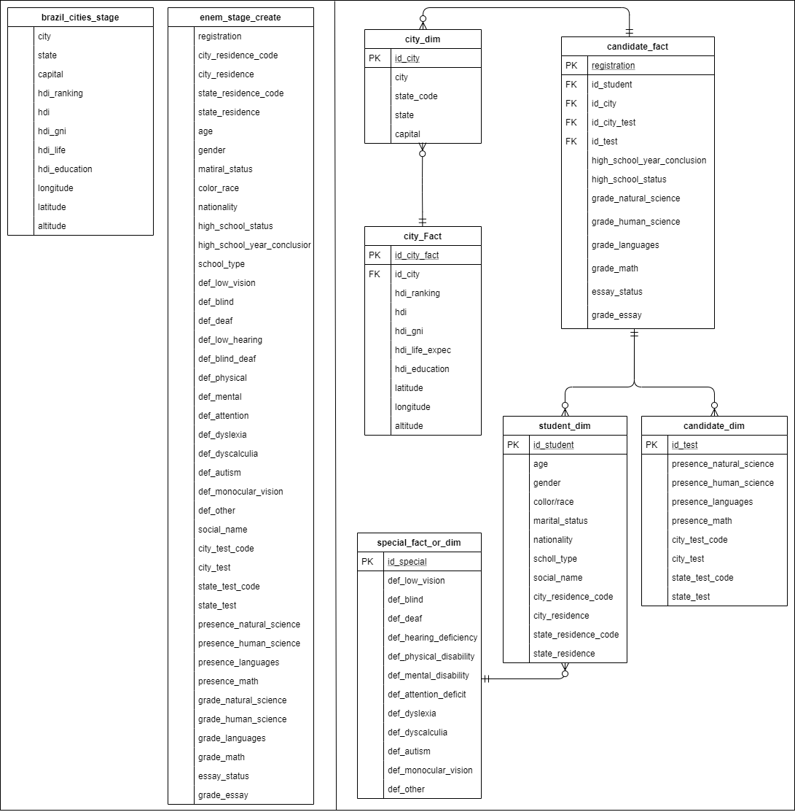

# Udacity Data Engineer Capstone Project
Autor: [Davidson de Faria](https://github.com/davidsondefaria/Capstone)

## Overview
The purpose of this project is to apply the knowledge acquired in the Udacity Data Engineering course. Data Lake, Spark and Airflow concepts and technologies were applied to load raw data into Amazon S3 storage and transform it into analyzable data in Redshift.

Although Udacity presents a US demographic and immigration dataset, it was decided to use Brazilian demographic and educational data to **prepare a database** to analyze the relationship between the grades obtained in ENEM, the *Exame Nacional do Ensino Médio* (in English 'High School National Exam', an application test for Universities), with the educational HDI of the Brazilian cities.

## Dataset

Two datasets of different bases were used:

- [Brazil Cities](https://www.kaggle.com/crisparada/brazilian-cities): this dataset is a compilation of data on Brazilian cities taken from different websites. Although there are many interesting fields for analysis, the focus of the project is to prepare a basis for the analysis of HDI data.
- [Enem2018](http://portal.inep.gov.br/web/guest/microdados): this dataset presents all the non-sensitive data of the students who took the ENEM 2018. Through it, we can analyze the grades of each student by city, by age, by financial conditions, if they have any disabilities and other specifics.

### Source Files
The files can be found in [Google Drive](https://drive.google.com/drive/folders/1BoA9AlCZWviPwzGHz71rrIgKCUXGHr2q).

- `brazil_cities.csv`: Original dataset about cities.
- `brazil_cities_dictionary.csv`: File with subtitles for the dataset columns. 
- `enem/enem_2018.csv`: Dataset about ENEM 2018. This dataset has previously been reduced its number of columns due to its size. But keeping the original name of the columns in Portuguese.
- `enem/enem_2018_dictionary.csv` and `enem/enem_2018_dictionary.xlsx`: Both files have subtitles for ENEM columns. In Portuguese.

After the data is processed, they will have the following columns:

##### Brazil Cities Columns Subtitles

|   Columns   |               Legend                  |
|-------------|---------------------------------------|
|city         |Name of Cities                         |
|state        |State of Cities                        |
|capital      |Is State Capital?                      |
|hdi_ranking  |Human Development Index Ranking        |
|hdi          |Human Development Index                |
|hdi_gni      |Human Development Index GNI per Capita |
|hdi_life     |Human Development Index Life Expectancy|
|hdi_education|Human Development Index Educational    |
|longitude    |Longitude                              |
|latitude     |Latitude                               |
|altitude     |Altitude                               |

##### Enem 2018 Columns Subtitles

|         Columns           | Legend                       |         Columns        | Legend                         |
|---------------------------|------------------------------|------------------------|--------------------------------|
|registration               |Number of Registration        |def_dyslexia            |Is dyslexic?                    |
|city_residence_code        |Code of Residence City        |def_dyscalculia         |Has dyscalculia?                |
|city_residence             |Residence City                |def_autism              |Is autistic?                    |
|state_residence_code       |Code of Residence State       |def_monocular_vision    |Has Monocular Vision?           |
|state_residence            |Residence State               |def_other               |Has any Other Disability?       |
|age                        |Age                           |social_name             |Social Name                     |
|gender                     |Gender                        |city_test_code          |Code of Application City        |
|matiral_status             |Marital Status                |city_test               |Application City                |
|color_race                 |Color or Race                 |state_test_code         |Code of Application State       |
|nationality                |Nationality                   |state_test              |Application State               |
|high_school_status         |Has finished High School?     |presence_natural_science|Presence in Natural Science Test|
|high_school_year_conclusion|Year of High School Conclusion|presence_human_science  |Presence in Human Science Test  |
|school_type                |Type of High School           |presence_languages      |Presence in Languages Test      |
|def_low_vision             |Has Low Vision Deficiency?    |presence_math           |Presence in Math Test           |
|def_blind                  |Is Blind?                     |grade_natural_science   |Grade in Natural Science Test   |
|def_deaf                   |Is Deaf?                      |grade_human_science     |Grade in Human Science Test     |
|def_low_hearing            |Has Low Hearing Deficiency?   |grade_languages         |Grade in Languages Test         |
|def_blind_deaf             |Is Blind and Deaf?            |grade_math              |Grade in Math Test              |
|def_physical               |Has Physical Deficiency?      |essay_status            |Essay Status                    |
|def_mental                 |Has Mental Deficiency?        |grade_essay             |Grade in Essay                  |
|def_attention              |Has Attention Deficit?        |

## Project Scope
The scope of this project is to read raw data, normalize, filter and treat them in order to obtain only the data of interest for a future analysis of the relationship between the educational development of cities and the grades obtained in the national exam.

The file is uploaded from local to `Amazon S3` to make it easier to upload to other storage.

Then, the data is loaded from Amazon S3 to `Amazon Redshift` in stage tables, processed and created the dimension and fact tables, from which the analysis can be done.

Finally, a data quality check was performed.

The entire process is carried out with the aid of `Airflow` to control the data flow.

*Loading raw local data to S3 and then S3 to Redshift is redundant, but it was done for the purpose of learning and practicing what was learned in the course.*

## Data Model
The `snowflake` scheme for the data model was chosen because of the many relationships between the tables and because it is two different datasets.

#### Dimensions
- `candidate_dim`: Stores data about the status and city of the test. 
- `student_dim`: Stores non-sensitive personal data about the student.
- `special_dim`: Stores data about the student's special needs.
- `city_dim`: Stores data about cities

#### Facts
- `candidate_fact`: Stores data about grades and lists the city, student, test and special needs tables.
- `city_fact`: Stores numerical location and HDI data of cities.

## Scenarios
The following scenarios were requested to be addressed:

1. **The data was increased by 100x**: Since Amazon has scalable data in its stores, data growth is not an issue. This project can still be expanded for the analysis of ENEM in previous years.

2. **The pipelines would be run on a daily basis by 7 am every day**: Airflow allows you to make a schedule for the pipeline to run from time to time, so it could happen daily at 7am. Although it makes more sense for this pipeline to occur annually.

3. **The database needed to be accessed by 100+ people**: That wouldn't be a problem as Redshift is highly scalable.

